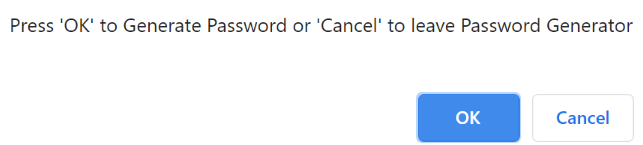
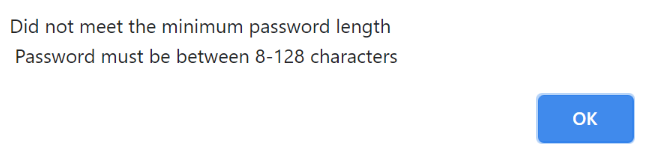

# Password Generator

## **The Password Generator**
A password generator is a quick an easy way to create a password, meeting parameters provided by the user. Using multiple forms of error checking, we can ensure that the user does not got trapped in the code during password generation. 

- Prompts the user on click of the 'Generate Password" button to enter parameters based on numbers one through five

- By typeing '-1' the user is prompted with options to exit the password generator or generate a password

- Attempting to generate passwords without specifying length returns the following message

- The password must be between 8-128 characters. Attmepting to enter a password outside of these parameters returns the following function.

- A visual representation of the users input are returned on the prompt, which allows users to re-enter parameters before password generation

- Attempting to generate password without entering all parameters returns the following prompts. All parameters must be filled with true or false

- A yes or no is required to determine if the user requires an uppercase, lower case, numerical or a special characters. 

- If a user does not enter yes or no, they are met with an alert. Whitespace and casing is ignored, but multiple words are not accepted.

- Although the user is capable of entering all falses for the prompts.

- The password will not generate and the user will be returned back to the menu to change their parameters

- Selecting a parameters would return us a password of the user specified length and parameter selection(s)

- One Parameter

- Two Parameters

- Three Parameters

- Four Parameters

- The password object then resets for the next set of password parameters on button press

# Why it Matters?
Having a password generator that efficiently generates a unique password for a user is important to secure vital accounts. Having a truely, random password generator would require a seed generation as opposed to using a simple random number generator based on the systems timing..

Visit my password generator [by clicking here](https://brobro10000.github.io/password-generator) or follow the direct link at [https://brobro10000.github.io/](https://brobro10000.github.io/password-generator). 

## 
We Hope to see you there!
 ##